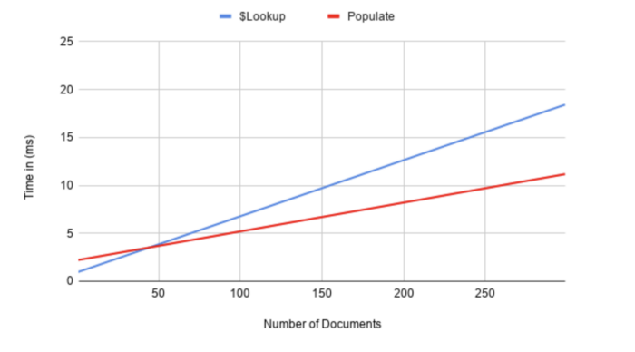

# MongoDB의 lookup vs Mongoose의 populate

MongoDB에는 버전 3.2 이상에서 조인과 유사한 $lookup 집계 연산자가 있다.

Mongoose에는 populate()라는 다른 컬렉션의 도큐먼트를 참조 할 수 있는 강력한 대안이 있다. (SQL의 LEFT JOIN과 유사)

populate는 $oid로 모두 조회를 해서 자바스크립트 단에서 합쳐주는 것이지 JOIN처럼 DB 자체에서 합쳐주는 것이 아니다.

다음은 차이점에 대한 요약이다.

```
$lookup
* aggregate와 함께 사용할 수 있습니다.
* 모든 필드에서 참조 도큐먼트를 가져올 수 있습니다.
* 일반적으로 서버 측 작업이므로 성능이 더 우수합니다.
* MongoDB 3.2 이상 필요
Mongoose populate()
* find 및 aggregate와 함께 사용할 수 있습니다.
* _id 참조 도큐먼트 만 가져올 수 있습니다. 
* MongoDB 버전 요구 사항 없음
```



$lookup이 populate()보다 성능이 더 좋은 경우는 도큐먼트 조인 수 <20을 처리 할 때이다. 따라서 findOne 또는 limit(<20)을 사용하는 경우 $lookup을 사용하는 것이 더 성능이 좋다. 그렇지만 findOne을 사용하는 조회에서 $lookup이 두 배 빠르지만 실세 시간의 차이는 미미하다.(0.5ms 대 1.5ms).

MongoDB는 쿼리시 필요한 모든 정보가 도큐먼트에 있을 때가 가장 성능이 좋다. 

---
#### 참고

https://mongoosejs.com/docs/populate.html

https://www.zerocho.com/category/MongoDB/post/59a66f8372262500184b5363

https://stackoverflow.com/questions/55575806/mongoose-populate-vs-aggregate

https://medium.com/cameoeng/mongodb-lookups-and-populates-an-unexpected-journey-940e08e36a94