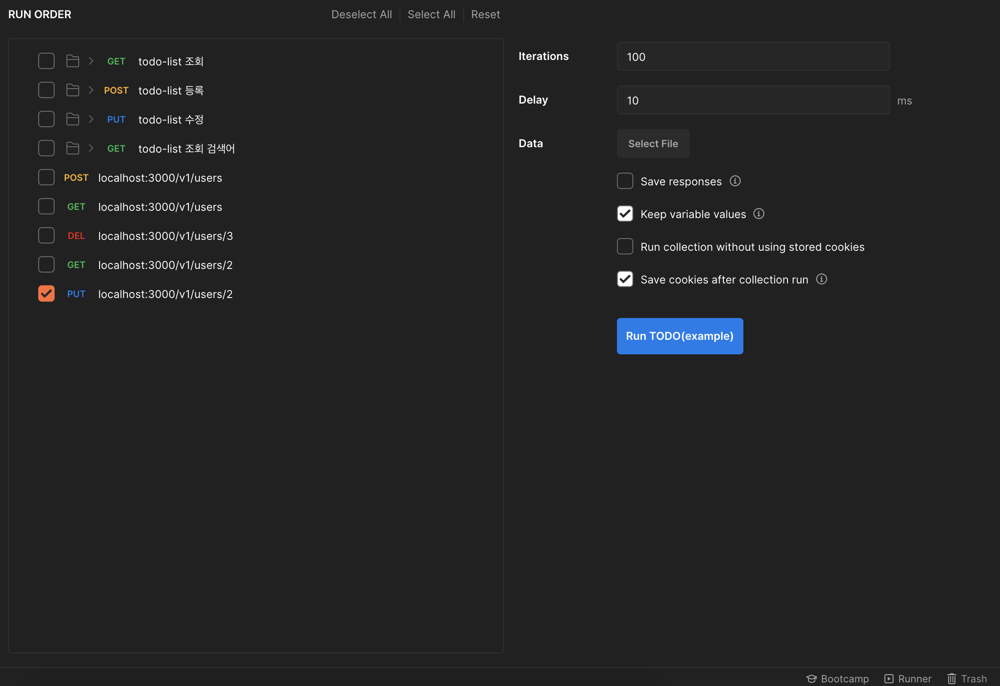
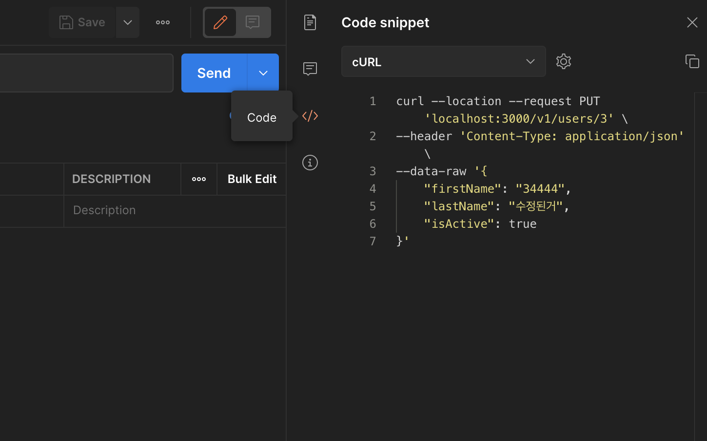
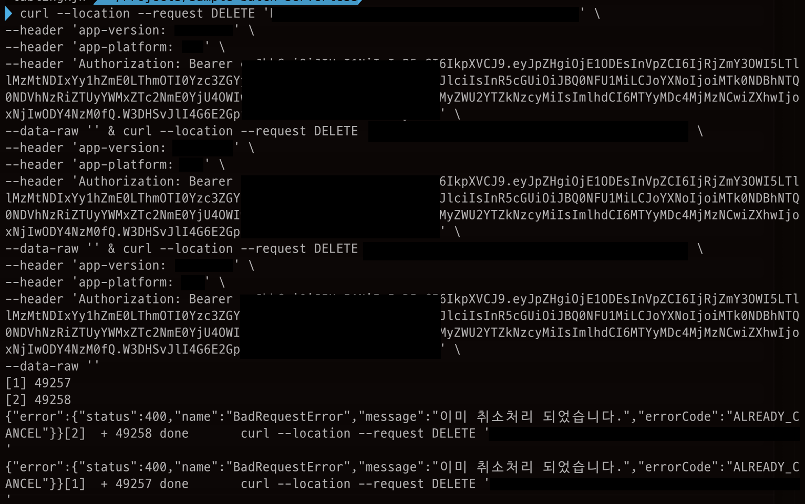

# 간단하게 병렬로 API 요청 보내는 방법

어떤 API에 병렬로 동시에 여러 요청을 보내서 테스트를 해야 하는 일이 생겼다.

영화관에 좌석을 예약하는데 병렬로 동시에 들어왔을 때의 경우나 무언가를 수정하는 API에 동시에 요청이 들어왔을 때 테스트를 위함이었다.

API 테스트 부하 도구들을 많았다. [autocannon](https://github.com/mcollina/autocannon), [loadtest](https://github.com/alexfernandez/loadtest) 등이 있다.

API 하나만 테스트하고 싶었고, 위의 도구들의 사용법을 굳이 익히지 않아도 간단하게 하는 방법이 필요했다.

처음에는 Postman의 Test Runner를 사용해보았다.



하지만 Delay가 아무리 줄어도 동기 방식이었기 때문에 병렬로 동시에 보내는 요청이 아니었다. 순차적인 요청이었기 때문에 적합한 테스트 방식이 아니었다.

Postman에서 지원해주지 않는 것 같아서 검색을 해보니 curl로 간단하게 병렬로 요청을 보내는 방법이 있었다.

```bash
curl url1 & curl url2 & curl url3 & ...
```

url1과 url2를 같은 url로 하면 동시에 병렬로 요청이 가능하다.

테스트가 필요한 API는 Header에 인증정보와 몇 가지 다른 정보들이 있었는데 Postman에서 curl 코드로 변환해주는 기능이 있었다.



아래와 같이 테스트가 가능하다.



---
#### 참고

https://stackoverflow.com/questions/36157105/postman-how-to-make-multiple-requests-at-the-same-time

https://stackoverflow.com/questions/49432735/converting-a-postman-request-to-curl