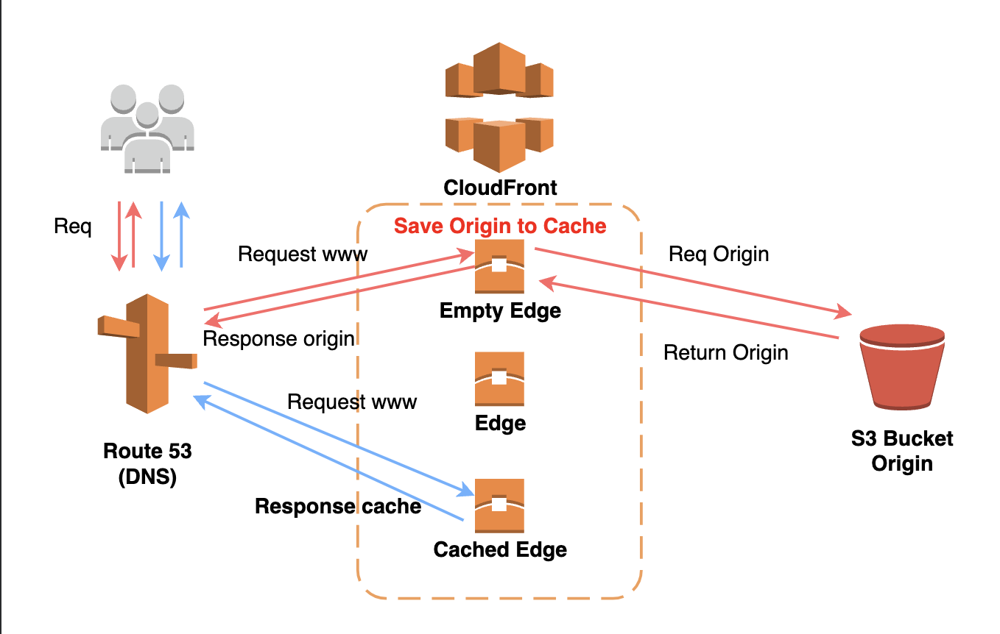
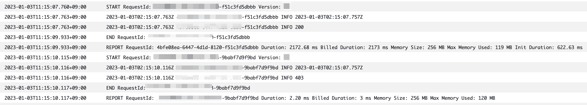
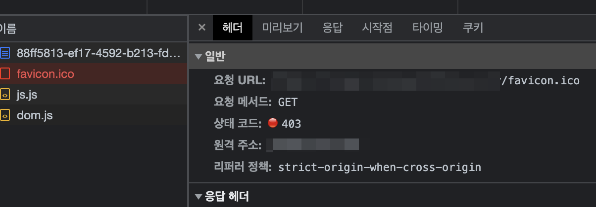
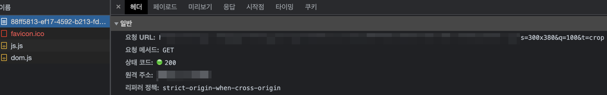

# Lambda@Edge

#### 캐싱 관련



캐시를 확인할 때 확인할 HTTP 헤더

- X-Cache
- age

캐시 설정에 사용되는 HTTP 헤더

- Cache-Control
- Expires

응답 헤더의 `X-Cache`를 보고 캐시 여부를 확인할 수 있다.

Hit from cloudfront: 캐시 히트. CloudFront에서 가져온다.

RefreshHit from cloudfront: CloudFront에 캐시가 있었지만 캐시 보유 기간이 부족하여 오리진에서 다시 가져온다.

Miss from cloudfront: 캐시 미스. CloudFront에 캐시가 없으므로 오리진에서 가져온다.

`age`의 값을 보고 캐시된 지 몇 초후 인지 알 수 있다. `age: 100`이라면 캐시가 된지 100초가 지났다는 뜻이다.

CloudFront 캐시에 이미 최신 버전이 있는 경우 오리진에서는 304 상태 코드(수정되지 않음)를 반환한다.

CloudFront 캐시에 최신 버전이 없는 경우 오리진에서는 200 상태 코드(OK)와 최신 버전의 파일을 반환한다.

- Maximum TTL(최대 TTL)을 5분(300초)으로 설정하고 Cache-Control max-age 헤더를 1시간(3600초)으로 설정하면 CloudFront는 1시간이 아니라, 5분 동안 객체를 캐싱한다.
- Cache-Control max-age 헤더를 3시간으로 설정하고 Expires 헤더를 1개월로 설정하면 CloudFront는 1개월이 아니라, 3시간 동안 객체를 캐싱한다.
- 기본 TTL(Default TTL), 최소 TTL(Minimum TTL) 및 최대 TTL(Maximum TTL)을 0초로 설정하면 CloudFront는 항상 오리진에서 최근 콘텐츠를 검색한다.

Object Caching

- Use Origin Cache Headers: 오리진에서 Cache-Control을 관리하여 CloudFront 시간의 캐시 유지 시간을 관리한다. 오리진의 cache-control을 그대로 사용한다.
- Customize: 오리진의 Cache-Control을 사용하는 게 아닌 사용자 설정을 통해 오브젝트의 캐시 관련 시간을 지정한다.

#### Error: VipsJpeg: Invalid SOS parameters for sequential JPEG

```json
{
  "errorType": "Error",
  "errorMessage": "VipsJpeg: Invalid SOS parameters for sequential JPEG\n",
  "stack": ["Error: VipsJpeg: Invalid SOS parameters for sequential JPEG", ""]
}
```

배포한 Lambda@Edge에서 sharp를 사용하고 있는데 CloudWatch 로그에 `[Error: VipsJpeg: Invalid SOS parameters for sequential JPEG ]`가 출력되고 있습니다.

해결 방법

```ts
const resizedImage = await sharp(s3Object.Body, {
  failOn: "truncated",
}).rotate();
```

- https://devs0n.tistory.com/98
- https://github.com/lovell/sharp/issues/1578

#### Lambda@Edge 브라우저 호출 관련

CloudFront와 Lambda@Edge를 사용해서 실시간 이미지 리사이징이 이미 구축되어 있다.

테스트를 위해서 테스트 환경을 만들어서 테스트를 하고 있는 중에 어느 순간부터 URL에 1번 접근한건데 Lambda@Edge의 CloudWatch의 로그에는 2번이 찍혀서 나왔다.



처음에는 함수를 2번 실행하는 것인가 착각했는데 알고보니 아래 사진처럼 웹에서 호출해서 발생한 문제였다.

포스트맨을 사용하면 1번의 요청에 1번의 CloudWatch 로그가 정상적으로 남겨진다.

웹에서 URL을 치고 접속을 하면 `/favicon.ico`도 같이 호출해버렸던 문제이다.





브라우저에서 `favicon.ico` 파일에 대한 요청을 자동으로 보내기 때문이다.

---

#### 참고

[Amazon CloudFront에서 지정한 시간 동안에 파일을 캐싱하지 않는 이유는 무엇입니까](https://aws.amazon.com/ko/premiumsupport/knowledge-center/cloudfront-cache-files-time/)

[Cache 설정](https://yogae.github.io/aws/2019/05/23/aws_cache.html)

[[AWS] CloudFront 캐시 삭제, CDN 캐시 무효화](https://kiwinam.com/posts/42/remove-cache-cloud-front/)
