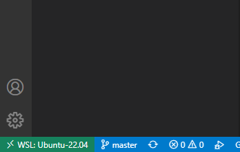
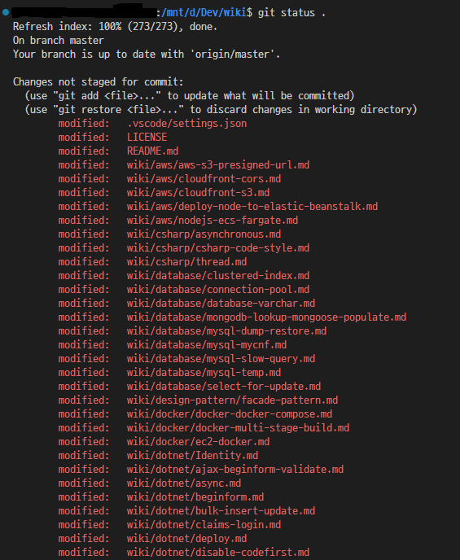

# WSL2

WSL2는 [윈도우10 WSL2 설치하기, WSL2 우분투 설치하기](https://gaesae.com/161)와
[이전 버전 WSL의 수동 설치 단계](https://learn.microsoft.com/ko-kr/windows/wsl/install-manual#step-6---install-your-linux-distribution-of-choice)를 참고해서 설치했다.

#### WSL2 설치 과정 정리

1. Windows PowerShell을 관리자 권한으로 실행
2. `dism.exe /online /enable-feature /featurename:Microsoft-Windows-Subsystem-Linux /all /norestart`
3. `dism.exe /online /enable-feature /featurename:VirtualMachinePlatform /all /norestart`
4. 컴퓨터 재부팅
5. Windows PowerShell에서 `wsl --set-default-version 2` 실행
6. 윈도우용 리눅스 커널 설치
7. 마이크로소프트 스토어에서 ubuntu를 검색해도 결과가 나오지 않아서 [이전 버전 WSL의 수동 설치 단계](https://learn.microsoft.com/ko-kr/windows/wsl/install-manual#step-6---install-your-linux-distribution-of-choice)에서 설치
8. 설치 이후에 언어는 영어로 설정하고 계정을 생성해서 완료한다.
9. 윈도우 키 + S키를 눌러서 나온 검색창에서 Ubuntu를 검색해도 나오지 않았다. 그래서 윈도우 터미널을 켜서 실행하거나 `wsl`을 검색하면 제대로 나온다.

#### VSCode에서 사용하는 방법
1. [WSL extension](https://marketplace.visualstudio.com/items?itemName=ms-vscode-remote.remote-wsl)을 설치한다.
2. 기존에 사용하는 프로젝트에서 좌측 하단의 초록색 아이콘을 눌러서 Open Folder in WSL을 선택해서 원하는 프로젝트를 WSL 환경에서 띄운다.


#### VSCode에서 WSL2 환경에서의 문제점
1. `git status` 명령어를 입력하면 모든 파일이 수정된 것처럼 나온다.

2. WSL의 [git status shows all files as modified](https://github.com/microsoft/WSL/issues/184) 이슈를 확인하면 해결할 수 있다.
```sh
# For the current repository
git config core.filemode false   

# Globally
git config --global core.filemode false

git config --global core.autocrlf true
```
- `git config --global core.filemode false`와 `git config --global core.autocrlf true`를 사용해서 해결했다.
- global 옵션은 개인의 선택이다. 해당 명령어를 사용하지 않고 Linux 환경에서 작업하는 것과 같도록(LF를 사용) 변경사항을 전부 커밋해서 해결해도 된다.
3. VSCode의 Extension들도 WSL2 환경으로 다시 설치해야 한다.
4. git 설정도 다시 해야 한다.
```sh
git config --global user.name "JaeHyeok Kim"
git config --global user.email "dev.jhyeok@gmail.com"
```
5. VSCode에서 소스 제어 환경이 코드를 수정하면 바로 반영되지 않고 새로고침 버튼을 눌러야 변경사항이 적용되는 것 같다.
- 이 문제는 윈도우 디렉토리에 있는 파일들을 WSL2 환경에서 접근해서 VSCode로 작업을 했기 때문이다.
- WSL2의 디렉토리에서 git clone을 받거나 윈도우의 파일을 복사해서 작업을 하면 바로 반영된다.
- WSL2에서 `explorer.exe .` 명령어를 사용하면 윈도우에서 볼 수 있다. 파일 옮길 때 숨김 항목도 보이게 해서 `.git` 파일도 같이 옮기는 것이 편하다.
- VSCode가 느리다는 느낌도 사라졌다.