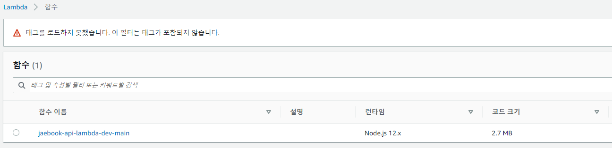

### 20200325
---

Serverless 해보기

먼저 AWS 계정에서 Serverless 에 접근가능한 IAM 권한을 가진 계정을 추가한다.

그리고 그 계정의 access_key와 secret_access_key를 ~/.aws/credentials에 사용한다.

윈도우 사용자의 경우 `C:\Users\JHyeok` 처럼 사용자 계정 디렉토리에 위치하고 있다.

그리고 기존 프로젝트에서 serverless를 사용하기 위해서는 아래 처럼 패키지를 설치해야한다.

```
yarn add express aws-serverless
yarn add --dev @types/aws-serverless-express 
yarn add --dev serverless serverless-offline serverless-plugin-optimize serverless-plugin-typescript
```

```yml
service: jaebook-api-lambda

plugins:
  - serverless-plugin-typescript
  - serverless-offline
  - serverless-plugin-optimize

provider:
  name: aws
  runtime: nodejs12.x
  stage: dev
  region: ap-northeast-2
  environment:
    NODE_ENV: production

functions:
  main:
    handler: src/lambda.handler
    events:
      - http:
          cors: true
          path: "{proxy+}"
          method: any
      - http:
          cors: true
          path: "/"
          method: any

package:
  individually: true
```

serverless.yml에서 TypeScript 때문에 `serverless-plugin-typescript`를 사용한다.

`serverless-offline`은 Serverless 어플리케이션을 로컬 환경에서 동작하게 하는 Serveless 플러그인이다.

서버리스 관련 Package를 설치하고 `sls offline start`로 로컬에서 테스트가 가능하고, `sls deploy`로 배포가 가능하다.

`sls deploy`를 실행해보니 완료됬다고 떠서 AWS 계정에 들어가서 확인해보니 `serverless.yml` 설정대로 생성이 되었다.



offline 모듈을 이용해서 로컬에서 테스트를 해보았는데 빈페이지만 나오고 있는 상태이다. deploy로는 500 오류가 나오고 있는데 그래도 계속 오류가 나면 지금 설치되어 있는 routing-controller 관련 소스나 DB 관련 소스를 주석처리해보고 시도를 해봐야 겠다. 그리고 serverless-http로도 해봐야 할 것 같다.

내일은 DB관련이나 환경변수 관련해서 알아봐야 할 것 같다. `serverless-dotenv-plugin`을 사용하면 환경변수를 설정할 수 있는 것 같다.

---
#### 참고

https://github.com/hakimio/nest-serverless/blob/master/serverless.yml

https://velog.io/@ashnamuh/Serverless%EB%A5%BC-%EC%9D%B4%EC%9A%A9%ED%95%B4%EC%84%9C-Nuxt-%ED%94%84%EB%A1%9C%EC%A0%9D%ED%8A%B8-AWS-lambda%EC%97%90-%EB%B0%B0%ED%8F%AC%ED%95%98%EA%B8%B0-m8jwvwwshc

https://blog.cookapps.io/frameworks/serverless/tutorial-serverless-express-aurora/#step-2-serverless-yml-%EC%83%9D%EC%84%B1-%EB%B0%8F-%EC%84%A4%EC%A0%95
