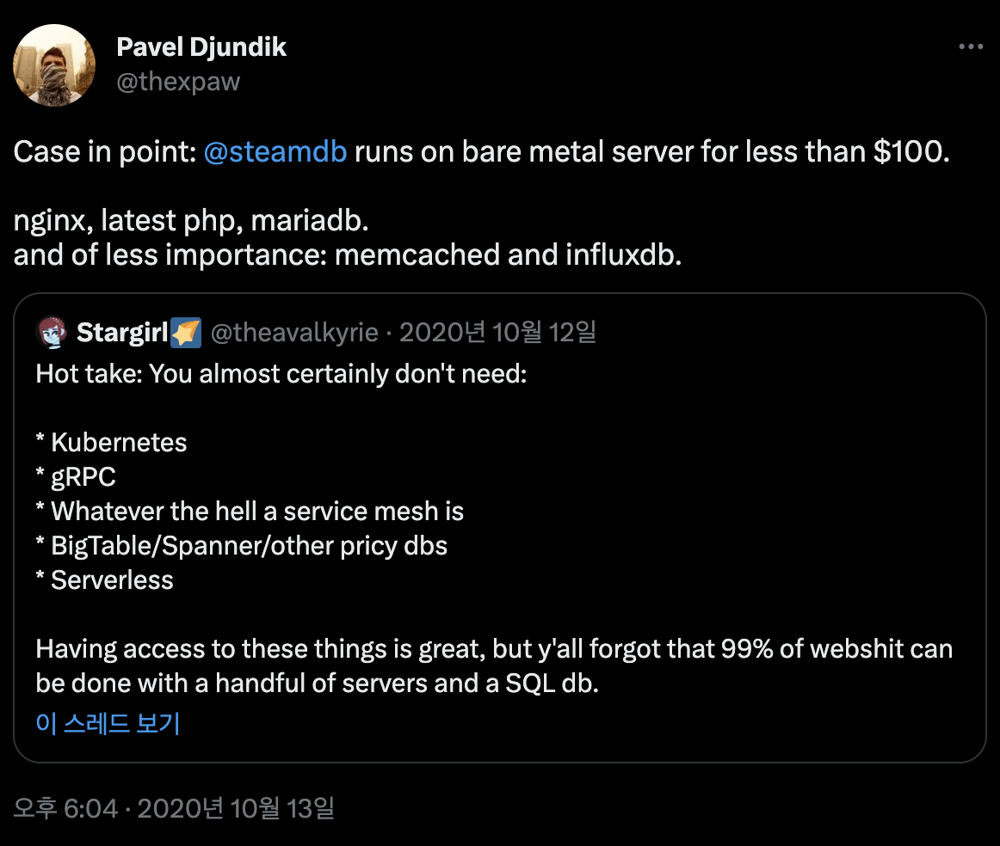
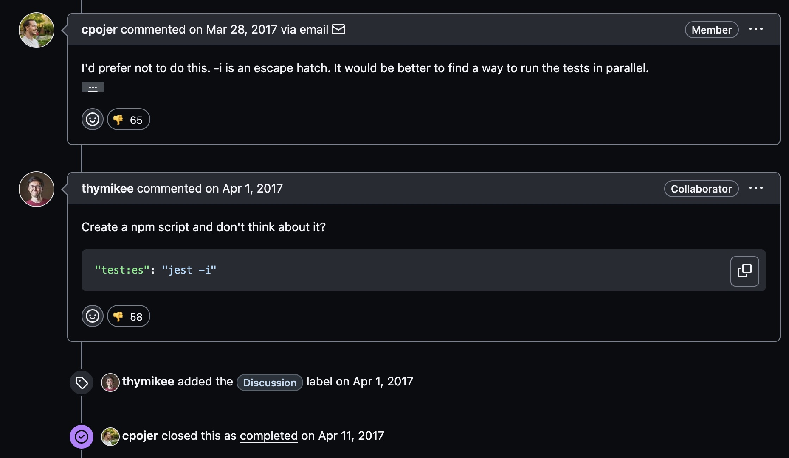

# 2023년 메모

## 2023-01-02

회사에 오랜만에 출근을 해서 리얼포스 R3 키보드를 다시 연결했는데 배터리가 6% 정도 더 늘어난 상태로 나왔다. 결론은 장기간 사용을 하지 않을 때는 수동으로 전원을 꺼서 기존 맥북에서 연결이 해제되었는지 확인을 해야 할 것 같다.

## 2023-01-04

Lambda@Edge를 수정했다. 3년 전의 오래된 코드로 되어 있어서 이번에 이슈를 해결하면서 테스트를 할 수 있는 스테이징 환경도 만들고 Node.js 버전과 패키지 버전들도 최신으로 올렸다. 이번에 테스트하면서 Lambda@Edge에 대해서 많이 공부했다.

## 2023-01-09

팀에서 스타일 가이드 관련 회의를 했다. 2023년이 되어서 팀 내에서 좋은 개발 문화를 위해서 정비를 시작하는 것 같아서 좋다.

## 2023-01-13

회사에서 게더링 데이를 개최했다. 오프라인으로 다들 모여서 이야기도 하고 즐길 수 있는 게임도 있어서 즐거운 시간이었다.

## 2023-01-18

eslint-plugin-import가 회사 프로젝트에 설치되어 있지만 제대로 사용을 하지 못하는 것 같아서 수정했다. 전반적으로 ESLint와 Prettier를 점검했다.

## 2023-01-19

여러 회사의 여러 팀들이 사용하는 Github PR 규칙들을 정리해서 참고용으로 팀에 공유하고 APM을 모니터링해서 내가 담당한 서버들이 아니지만 중요도가 높은데 느린 API를 팀에 공유했다.

## 2023-01-20

스타일 가이드 관련 회의했던 내용을 ESLint에서 강제할 수 있는 방법을 찾아서 적용했다. 강제하지 않으면 사람이 실수로 넘어가는 경우들이 있었다.

## 2023-01-22

M1 맥북에서 Gatsby 블로그 환경을 수정하다가 내가 에디터 설정은 .gitignore에 추가하지 않은 것을 뒤늦게 확인하고 추가했다. 기존에 윈도우 컴퓨터의 WSL2에서는 왜 이런 문제가 없었는지 모르겠다. 그런데 개발 환경에서 이미지가 엑스박스로 깨져서 나와서 다시 윈도우 컴퓨터의 WSL2로 옮겼다. sharp 라이브러리 관련 문제 같다.

## 2023-01-23

며칠간 틈틈이 작성했던 2022년 회고를 블로그에 올렸다. 23년도가 시작한 지 한 달이 다 되어가서 올린 늦은 회고이다.
반성하고 다음의 회고는 빠르게 올려야겠다. 메모를 꾸준히 작성하면 회고 작성에 쉬울 것 같았는데 작성은 쉬웠지만 내가 너무 게을러진 것 같다.

## 2023-01-30

Github Actions에서 재사용 가능한 워크플로우(Reusing workflows) 작업과 Composite 액션을 하나의 Repository에서 관리하도록 작업을 하고 있다.
중복되는 Github Actions 스크립트를 줄이기 위해서이다.
그런데 env 값을 넘길 때 아직 해결되지 않은 이슈 때문에 작은 문제가 있다.
["Unrecognized named-value: 'env'. Located at position 1 within expression" when used in reusable workflow jobs
](https://github.com/actions/runner/issues/2372)

슬랙 Github APP을 개인 메시지 채널에서 구독을 해서 사용을 했는데 공통 팀 채널을 만들고 거기서 앱을 추가해서 구독을 해서 사용이 가능하다는 것을 알아서 백엔드 PR 전용 채널을 만들고 구성했다. 이미 다른 팀에서도 이런 방식으로 사용을 하고 있었다.

## 2023-01-31

우리 팀에서 기술 공유를 시작했다. 이번 2023년도부터 시작을 했는데 정해진 기간마다 돌아가면서 한 명씩 주제를 정해서 공유를 하기로 했다. 오늘은 팀장님이 정적코드 분석 도구 소나큐브에 대해서 기술 공유를 해주셨다. 직접 설치를 하셔서 데모까지 보여주셨는데 적용해도 될 정도로 사용하기도 편했고 괜찮은 것 같았다.
이번 2023년도부터는 Github PR로 대부분의 코드들을 코드 리뷰를 하기로 하고 정기적인 주간 회의와 기술 발표, 팀 내 컨벤션 재정의 등 팀의 인원이 많아지면서 우리 팀의 개발 문화(환경)가 점점 더 좋아지는 것 같다.

## 2023-02-01

연말정산 자료를 제출했다.
국세청홈택스에 로그인을 할 때 이전에 어떤 인증서로 했는지 몰라서 고민했다. 로그인하는 방법들이 많으니 이런 문제가 있다. 결국은 찾았는데 카카오톡 인증으로 로그인을 했었다.

## 2023-02-02

팀에서 공통으로 사용하도록 만든 재사용 가능한 워크플로우와 Compostie 액션을 사용하도록 담당하고 있는 서버의 Github Actions 스크립트를 수정했다. 깔끔하게 정리가 된 것을 보니 마음이 편안하다.

## 2023-02-04

여러 회사들의 모노레포 사례를 보고 NestJS의 모노레포 모드를 활성화해서 연습했다. 공통된 코드들이 유즈케이스 별로 구현된 서버들에 무분별하게 중복으로 사용되고 있던 부분에 대해 고민을 하고 있던 우리 팀에 오히려 적합한 방식이 아닐까 생각한다.

## 2023-02-06

개인적으로는 모노레포로 분산 모놀리틱으로 구성하는 것을 선호해서 팀원들에게 NestJS로 모노레포를 구성하는 과정을 보여드렸다. 하지만 팀에서 가장 중요한 서비스를 분리하기로 결정했다. 처음부터 모든 것을 분리하는 게 아닌 새롭게 추가되는 기능들 위주로 천천히 분리하기로 했다. 앞으로 이 서비스를 여러 서버에서 사용할 텐데 기술부채가 되지 않도록 노력하는 일만 남았다.

## 2023-02-07

gRPC 테스트를 위해서 직접 구현을 했다. client와 server 둘 다 NestJS를 사용한다면 편했을 것 같은데 일단은 clinet에서는 Express를 사용하기 때문에 비동기/동기 관련해서 조금 삽질을 했다. 이번에 gRPC를 구현하면서 server는 NestJS를 사용하기 때문에 구현 난이도에서 차이를 느꼈다. NestJS가 확실히 모던한 프레임워크라고 느꼈다.

## 2023-02-11

TypeORM의 saveOptions 관련 글을 작성하고 있다. 회사에서는 Sequelize만 사용을 하고 있어서 TypeORM을 프로덕션 환경에서 제대로 사용을 해본 적이 없었는데 연습용 프로젝트에서 save의 쿼리와 insert의 쿼리를 보고 Sequelize와 비교해서 글을 작성할 예정이다.

## 2023-02-12

모노레포를 테스트해보고 있는데 모노레포 구성에 Sequelize를 추가했다.

## 2023-02-15

팀원분이 회사에서 사용하던 NestJS 서버에 gRPC 적용이 안된다고 하셔서 해결해 드렸다. 원인은 `@nestjs/core`와 `@nestjs/microservices` 패키지 문제였다. 일단 첫째로 버전을 맞추는 것이 중요하고 `@nestjs/core`를 올리는 것보다는 이미 해당 `@nestjs/core` 버전에 맞추어서 NestJS 환경이 만들어져 있기 때문에 `@nestjs/core`에 맞는 @nestjs/microservices를 설치해서 해결했다.

## 2023-02-16

HTTP + gRPC로 구성을 변경했다. 공식 예제에서 `hybrid application (HTTP + gRPC)`를 찾아서 해당 예제로 구성을 했다. 혹시라도 gRPC를 처음 사용하는 것이기 때문에 HTTP가 필요할 경우를 대비해서 위의 방식으로 구성했다.

## 2023-02-17

gRPC 에러에 대한 처리를 회사 서버에 구성했다. 모든 에러에 대한 구현체들은 필요가 없을 것 같아서 [gRPC 상태 응답 코드](https://developers.google.com/maps-booking/reference/grpc-api/status_codes?hl=ko)를 보고 필요한 에러들만 구현했다.

처음 생각했던 것보다 신경을 써야 할 부분이 많았다.

## 2023-02-20

앱을 테스트를 하다가 스테이징 환경에서 502 에러가 발생했는데 ALB/ELB에서 502 에러를 응답한 거였다. 그래서 관련 내용을 찾아보니 ALB/ELB에 연결 유지 시간 제한이 있는데 애플리케이션(Node.js)의 keepAliveTimeout이 더 짧아서 생기는 문제였다.

## 2023-02-21

이번에 k6 부하 테스트를 진행하면서 요청을 할 때마다 랜덤값을 넣어야 하는 부분이 있었는데 JS 작성할 때 처럼 하니까 의도한 대로 잘 되었다. 계정 1개당 1번만 등록이 가능한 API의 경우에 부하 테스트를 어떻게 해야 할지 고민 중이다.

## 2023-02-22

코드 리뷰 과정에서 코드 리뷰를 반영한 커밋들이 우후죽순으로 생기는 것을 보고 원래는 2개의 커밋만 생기면 되는 것이 여러 번의 리뷰를 진행하게 되면서 커밋들이 여러 개 생기는 게 그 예시이다.

Github PR에서 머지를 할 때 옵션을 선택해서 이 커밋을 줄일 수도 있지만 우리 팀의 정책과 맞지 않기 때문에 이 프로젝트에서 만큼은 커밋을 정리하기로 했다. 다만 이 프로젝트에 참여하는 사람들을 설득을 해야 한다. 이 프로젝트에서 잘 적용이 되면 팀 내 다른 프로젝트에서도 적용할 때 좋은 본보기가 될 수 있을 것 같다.

## 2023-02-23

Node.js를 AWS에서 서비스하면서 로드 밸런서의 idle timeout과 Node.js 어플리케이션의 설정과 관련해서 여러 블로그 글들과 실험 결과들을 참고해서 ALB/ELB에서 발생하는 502 에러를 고치는 커밋을 PR 했는데 ChatGPT에게도 물어보니까 흥미로운 대답이 나왔다. 사실 다른 자료에서도 Node.js의 버전에 따라서 조금 차이가 있었는데 아직 테스트하기 전에는 긴가민가 했던 내용을 ChatGPT에게도 물어보면서 무언가 확인을 받는 느낌이 들어서 흥미로웠다.

## 2023-02-26

주말 동안 서버에 부하가 생겨서 확인을 했는데 MongoDB의 CPU 사용률이 높았다. 그래서 MongoDB Atlas에서 로그를 다운로드해서 Slow Query들을 모두 확인했다.

## 2023-02-27

해당 Slow Query를 해결하기 위해서 로컬에서 운영 컬렉션과 똑같이 복원해서 테스트를 했다. limit에 있는 필드가 단일 인덱스로 만들어져 있었지만 인덱스 교차가 되지 않는 부분도 있었고 다른 쿼리에서는 limit가 과거에 만든 필드를 기준으로 정렬하도록 되어있어서 인덱스가 없기도 했다. 그래서 일단은 문제를 해결하는 복합 인덱스를 몇 개 생성하고 컬렉션에 인덱스가 너무 많기 때문에 서버의 조회 쿼리들도 최적화 한 이후에 배포하고 문제가 발생한 컬렉션의 인덱스를 정리하기로 했다.

## 2023-02-28

복합 인덱스를 FETCH 없이 완전히 적용하기 위해서 새로 추가한 인덱스에 맞게 서버의 조회 쿼리도 수정해서 재배포했다. APM으로 확인할 결과 매우 만족스러운 결과를 얻었고 MongoDB Atlas에서 로그를 다운로드해서 확인했는데 해당 컬렉션의 Slow Query가 모두 사라졌다.

## 2023-03-02

MongoDB 컬렉션에서 Auto-increment 한 성격을 가진 필드를 만들어서 _id 대신 사용하는 것이 좋은지 고민했다.

## 2023-03-04

웨이브에서 '블랙회사에 다니고 있는데, 지금 나는 한계에 도달했는지도 모른다’라는 제목의 코디미 영화를 시청했다. 일본 특유의 과장된 캐릭터들이 나오고 조금 유치하지만 일본의 IT 업계의 현실을 풍자하는 코미디이다. 연출이 과장되었지만 현실의 많은 것들을 이야기해 주고 있고 일본 IT 업계가 한국과 별반 다르지 않다는 것을 느꼈다.

## 2023-03-06

개인 블로그를 수정하면서 이전에 ChatGPT를 이용해서 Gatsby를 사용하면서 나타나는 문제점을 해결했다고 생각했는데 절반 정도의 해결이었다. 관련 이슈와 정보를 ChatGPT에게 알려주니 코드를 다시 알려주었고 그 코드를 다시 이중으로 체크해서 문제를 해결했다. 진짜 조금만 더 발전하면 무서울 것 같다.

## 2023-03-08

구버전에서 사용하는 MySQL에 공백 문자 관련해서 데이터 처리를 해서 공백을 제거하고 저장했다. 그 과정에서 U+3000의 공백문자등 공백문자가 다 같은 공백문자가 아니라서 삽질을 조금 했다.

해결 방법은 간단하다.

`SET name = TRIM(REPLACE(name, '　', ' '))` 

해당 공백문자를 일반 공백으로 치환해서 TRIM을 하면 된다.

## 2023-03-14

회사 기술 공유에서 팀원분이 발표해 주신 ElasticAPM 내용을 보고 개인적으로도 확인이 필요해서 열심히 알아보았는데 gRPC에 대한 완전한 지원은 계속해서 미뤄지고 있는 것 같다. 지금은 사용하는 측에서 어느 정도 코드 작업이 필요하다.

그리고 회사 기술 공유 발표 주제를 정해야 하는데 딱히 발표할 내용이 없어서 주제를 정하기 어렵다.

## 2023-03-15

사람들마다 살아온 환경과 경험, 생각이 다르기 때문에 협업을 할 때 의견이 잘 조율되지 않을 때가 있다. 특히 요즘 백엔드와 모바일 앱, 프론트엔드가 나눠져 있는 환경에서 더욱 그렇다고 생각한다.

이전의 회사에서 웹 플랫폼을 개발할 때 ASP.NET MVC, ASP.NET CORE MVC를 사용하면서 백엔드와 프론트엔트를 같이 작업을 할 때는 이런 것을 잘 느끼지 못했는데 역할이 구분되어 있는 개발 환경에서는 이 부분이 참 어려운 것 같다.

## 2023-03-16

GeekNews와 Hacker News에서 재밌는 글을 읽었다. 돈을 전혀 벌지 못하는 사이드 프로젝트를 소개해달라는 내용의 글이었는데 이 글의 원문인 Hacker News의 댓글에서 SteamDB에 관련된 글이 흥미로웠다.

SteamDB: https://steamdb.info/ 10년 넘게 운영해 온 Steam 게임, 업데이트, 가격 내역, 차트 등의 데이터베이스입니다.
초기에는 금전적 기부를 받았지만 몇 년 전부터 중단했습니다. 운영 비용은 한 달에 100달러 미만입니다. Cloudflare는 지난 30일 동안 5억 5,220만 건의 요청과 609만 명의 순 방문자를 보고합니다.

이 댓글이 달리고 어떻게 적은 금액으로 서버를 운영하냐부터 방문자 수에 대한 재미있는 글들까지 있어서 재밌었다. 최근에 읽은 주제 중에서 가장 흥미로웠다.



이미지 출처: https://twitter.com/thexpaw/status/1315941483867000833

## 2023-03-17

이전에 [TechEmpower/FrameworkBenchmarks](https://github.com/TechEmpower/FrameworkBenchmarks)에 내가 PR 한 내용이 성능이 오히려 떨어져서 롤백해는 Revert Commit을 PR 했다. 테스트 환경이 누구나 사용할 수 있는 환경이 아니라서 PR을 처음에 하고 라이브 결과를 보고 다시 수정할 생각이었는데 [ASP.NET 관련 벤치마크에서 일하시는 분이 코멘트](https://github.com/TechEmpower/FrameworkBenchmarks/pull/7986)로 미리 알려주었다.

## 2023-03-21

회사에서 사장님들이 사용하는 서버에서 성능 이슈가 발생해서 팀원이 해당 문제로 고민을 하고 있는 것 같아서 [clinicjs](https://clinicjs.org/)를 추천했다.

하지만 나도 직접 사용은 해본 적이 없어서 이번에 사용해 보기로 했다.

공식문서의 예제처럼 우리가 사용하는 프로젝트에서 간단하게 되지는 않았지만 직접 해보면서 많은 것을 배웠다. 먼저 Doctor로 문제가 있는지 확인하고 Flame을 사용해서 추적했다. Flame과 autocannon을 같이 사용하는 방법이 있어서 이 방법도 시도했지만 근야 Flame을 하고 API를 요청하는 것이 나에게는 추적하기 더 쉬웠던 것 같다.

## 2023-03-22

[FE개발자를 대체할 수 있을까? (AI로 개발하기)](https://fe-developers.kakaoent.com/2023/230323-chatgpt-and-fe-developer/ChatGPT)를 읽었다. 흥미로운 내용이었다.

읽다 보니 프론트엔드 지식이 없는 상태로 Gatsby와 ChatGPT를 사용해서 문제를 수정하려 했던 내 모습과는 비교가 되었다.

## 2023-03-28

팀 내에서 기술 공유를 했다. 

맥북으로 keynote를 사용해서 발표 자료를 만들어 본 적은 처음이었는데 깔끔하게 나와서 좋았다. 기본적으로 제공하는 템플릿들이 괜찮았다.

새로운 기술에 대한 소개보다는 회사에서 일하면서 유저타입 서버를 운영하면서 트래픽 관련한 트러블 슈팅이나 개선한 내용을 발표했다.

## 2023-03-30

[Programming antipatterns](http://egloos.zum.com/kwon37xi/v/4634829)

## 2023-03-31

평소에 구독하고 있던 유튜브 채널에서 The expert라는 스케치 코미디를 시청했다. 처음 보는 것은 아니고 대학교 다닐 때 교수님이 보여주셨던 영상인데 지금은 개발자들 사이에서도 매우 유명한 영상이다. 그 당시에 보았을 때는 마음에 와닿지 않고 그냥 웃기다고만 생각하고 지나쳤는데 현업에서 일을 하는 입장에서 보니까 공감되고 슬펐다.

## 2023-04-01

Fastify를 처음 사용해 보았는데 CLI에서 테스트 코드까지 전부 다 작성을 해주는 것이 인상적이다. 아쉬운 점은 Quick Start를 보고 따라 하면 JavaScript를 기반으로 만들어진다는 것이다. 찾아보니 fastify-cli를 사용해서 TypeScript를 기반으로 시작할 수 있을 것 같다.

## 2023-04-02

JavaScript 기반의 Fastify를 cli에서 제공하는 TypeScript에 맞춰서 변경했다. 그런데 테스트 쪽을 확인해 보니 Node.js 진영에서 많이 사용하는 Jest, Mocha가 아니어서 조금 당황했다. tap을 사용하고 있었는데 처음 들어보는 프레임워크라서 검색을 해보니 tap은 Node.js를 위한 테스트 러너 및 테스트 프레임워크라고 하더라.

## 2023-04-06

소프트웨어 개발자는 요구사항을 해결하는 일을 하지만, 그 요구사항을 올바르게 이해하고 적절한 해결방법을 찾는 것이 매우 중요하다. 작은 문제일지라도 이를 부풀려서 문제를 잘못 이해하고 잘못된 해결방법으로 해결하게 되면, 시간과 비용이 많이 소모되며 결과적으로 만족스러운 결과물을 얻을 수 없을 가능성이 높다.

따라서 개발자는 문제를 이해하고 해결방법을 찾는 과정에서 충분한 분석과 검토를 거쳐야 한다. 문제의 본질을 파악하고, 필요한 정보를 수집하며, 가능한 해결방법들을 탐색하고 비교 분석해야 한다. 이를 통해 올바른 해결방법을 선택하고, 가능한 한 빠르고 효율적인 방식으로 문제를 해결할 수 있다.

## 2023-04-09

스터디 카페에서 공부를 하던 도중에 서버에 오류 알람이 여러 차례 울려서 상태를 확인했다.
개인적인 생각으로는 작은 인스턴스 1대로 서비스를 감당하는 것보다 이제 기본 사양도 늘려야 하지 않을까 생각한다. 기본 사양이 낮으니 스케일 아웃으로 인스턴스 대수를 여러 대 늘린다고 하더라도 갑자기 많은 트래픽의 요청이 들어오면 서버가 늘어나는 시간 동안 기존에 있던 기본 인스턴스 1대로 버티는데 어려움이 있는 것 같다.

## 2023-04-12

코드 리뷰할 때 코멘트를 조금 더 상세하게 전체적인 배경 지식을 기반으로 남겨야 한다. 상대방이 이 코드를 왜 고쳐야 하는지에 대해서 이해가 어려울 수도 있고 기분이 상할 수 있다.

회사 코드 컨벤션을 지키고, 코드는 한 사람이 짠 것처럼 누군가가 그 자리를 나가더라도 다른 사람이 보면 이해할 수 있도록 해야 하며, 돌아가는 코드는 누구나 짤 수 있기 때문에, 사람이 읽기 쉬운 코드를 짜야한다는 생각이 강하게 있다.

## 2023-04-14

팀 내에서 기술 공유를 했던 내용을 회사 기술 블로그에 올리기 위해서 초안을 작성했다.

## 2023-04-17

팀원분이 적극적으로 리뷰를 해주시고 좋은 아이디어도 알려주셔서 기술 블로그에 올리기 위해 작성한 초안이 더 풍성하고 완성도 있게 변했다.

## 2023-04-18

운영 환경에서 대략적으로 시간이 얼마나 걸리는지 테스트하기 위해 AWS EC2 인스턴스를 하나 만들어서 해당 인스턴스에서 스냅샷으로 복원된 RDS에 컬럼을 추가하는 작업을 했다. 터미널의 연결이 끊어져도 돌아가야 하기 때문에 nohup을 사용하려고 했는데 nohup.out이 원하는 방향으로 생성이 되지 않아서 이번에는 screen을 사용했다. 터미널을 종료하고 다시 들어오더라도 세션이 살아있기 때문에 해당 세션에 재접속을 해서 마치 터미널을 종료하지 않은 것처럼 화면을 볼 수 있어서 좋았다.

## 2023-04-22

회사에서 프로젝트를 진행하면서 기존의 Git 사용 방법에 대한 이야기가 나와서 다른 곳에서는 어떻게 Git을 사용하는지 확인하기 위해 여러 오픈소스 프로젝트를 로컬에 다운로드해서 Git 전략을 어떻게 사용하고 어떻게 GitHub PR을 관리하는지 확인했다.

## 2023-04-23

[[우아한테크세미나] 테크 리더 3인이 말하는 "개발자 원칙"](https://www.youtube.com/watch?v=DJCmvzhFVOI)을 유튜브에서 봤는데 이동욱 발표자님의 '제어할 수 없는 것에 의존하지 않기'가 인상적이었다.

발표 마지막에 '제어할 수 없는 것에 거리두기, 제어할 수 있는 것에 집중하기'가 오래 기억에 남을 것 같다.

## 2023-04-28

팀에서 백오피스 페이지의 필요성을 느껴서 만들고 있다. 이전에 있는 것은 유지보수가 힘들고 그 이외에 여러 이유로 인해서 다시 만들고 있다. 팀장님이 토대를 만들어 주셔서 거기서 작업을 하고 있다.
원래는 vue, vite를 사용하다가 Nuxt 3와 Quasar Framework로 만들고 있다. 한 번 해보니까 그렇게 어렵지 않은데 이번에 느낀 것은 프론트엔드 개발을 할 때 WebStorm이 아쉽다고 느껴졌다.

예를 들어서 WebStorm에서 `.vue` 확장자에서 definePageMeta를 사용할 때, `<script lang="js" setup>`일 때는 문제가 없지만 `<script lang="ts" setup>`에서 작성하면 해결되지 않은 함수 또는 메서드라면서 빨간 줄이 표시된다. 하지만 VS Code에서는 문제가 없었다.

## 2023-04-30

주말에 스터디 카페에서 공부할 때만 이상하게 문제가 발생한다. 나와 관련이 없는 문제이지만 노트북을 들고 자리에 있었기 때문에 원인을 파악한다…. 서버가 터지거나 하는 긴급 문제는 아니었지만…. 긍정적으로 생각하면 다행히 내가 있을 때 문제가 발생해서 대응이 가능하다는 정도인 것 같다.

## 2023-05-03

AWS Summit Seoul 2023을 갔다. 처음에 아침 일찍 갔을 때는 사람이 적은 줄 알았는데 점심시간쯤에 세션 이동하려고 하니까 사람이 진짜 바글바글했다. 우리나라 IT 관련 종사자들이 이렇게 많았나 하면서 놀랐다. 부스에서 여러 선물을 받았고 모니터링에도 관심이 있어서 부스에서 데모도 보고 질문도 드렸다.

## 2023-05-10

2023년도 스택오버플로우 서베이에 참여했다. 작년과 재작년에도 참여했었는데 이번에는 ChatGPT와 관련된 질문들도 있었다.

## 2023-05-12

회사에서 운영하는 서버리스 프로젝트가 있는데 function 배포가 불편하다. 서버리스 프레임워크의 deploy에서 `--function` 또는 `-f` 플래그를 사용하면 되는데 Lambda 함수의 구성에 트리거가 새로 배포가 되지 않는다. 특정 시간에 배치 스케줄러처럼 실행하는 함수여서 트리거가 생성되어야 하는데 트리거가 생성되지 않아서 수동으로 생성했다. function 배포를 하지 않고 전체 배포를 하면 문제없이 트리거가 생성된다.

## 2023-05-18

성능이 낮은 인스턴스의 MongoDB에서 countDocument()가 속도가 느리다. 400만 정도의 도큐먼트가 있는 컬렉션의 도큐먼트 수를 가져오는데 5초가 걸린다. 반면에 estimatedDocumentCount()를 사용하면 0.03초 만에 조회를 완료하기 때문에 문제가 해결된다.

## 2023-05-19

k6를 사용해서 바뀐 로직에 대해서 정합성과 성능에 대한 부하 테스트를 진행했다. 자세하게 적을 수는 없지만 데이터 정합성을 위해서 성능을 조금 포기하고 특정 부분을 Redis에서 MongoDB로 변경하였는데 생각보다 동시성 테스트에서 큰 성능 저하가 없어서 다행이라고 느꼈다. 오히려 목표했던 대로 데이터 정합성이 올라갔다.

## 2023-05-21

Git Flow 플러그인을 사용하지 않고 Github PR 만을 사용해서 서비스의 버전을 올리고 버전 태그를 만들고 릴리즈를 해보는 과정을 연습했다. IDE에 내장된 Git Flow 플러그인이 업데이트가 되지 않고 로컬에서 플러그인을 사용해서 master와 develop에 릴리즈 작업을 하는 것보다 GitHub PR로 작업을 하는 것이 로컬에 의존적이지 않고 더 안전하다고 생각했다.

개인적인 생각으로는 Git Flow는 오히려 복잡성을 증가시키는 것 같고, 일반적인 웹 애플리케이션에는 어울리지 않는 것 같다. 버전이 여러 개 나뉜 상태에서 프로덕션에 올라가거나 백포팅이 필요한 패키지 라이브러리에 적합한 전략인 것 같다.

## 2023-05-22

Java와 C#을 사용했던 개발자분들이 TypeScript를 사용한다면 아래의 글을 추천한다.

공식문서에 있는 [TypeScript for Java/C# Programmers](https://www.typescriptlang.org/ko/docs/handbook/typescript-in-5-minutes-oop.html)이다.

## 2023-05-25

[페이스북 DUC 연례확인 문제](https://developers.facebook.com/docs/development/maintaining-data-access/data-use-checkup/)가 발생했다. 간헐적인 실패처리가 발생해서 바로 대응을 하고 다음에는 이런 일이 없도록 회사 캘린더에 추가했다.

그리고 페이스북 그래프 API v10이 6월 8일부터 Deprecated 처리되는 것을 알고 확인해 보니 우리 서비스가 v10 버전을 사용한다는 것을 알았고 조치에 들어갔다. 연례확인 문제가 발생하지 않았으면 모를 뻔했다.

## 2023-05-28

주말에 MongoDB를 확인해 보니까 스냅샷 생성이 작동하고 있었다. 스냅샷 시간을 새벽 5시로 해서 안심하고 있었는데 6시간마다 돌면서 사용자가 많은 시간대에 도는 것을 확인했다. 크게 문제는 없겠지만 그냥 신경이 쓰여서 해당 스냅샷의 시간대를 최대한 사용자들의 사용이 뜸한 시간대로 정하면서 배치가 돌아가는 시간과 겹치지 않도록 조정했다.

## 2023-05-30

팀에서 사용하는 GitHub에서 오래된 Repository, Project 등을 정리했다.

기존에는 관리가 되어 있지 않아서 해당 Repository가 지금 사용되고 있는지 등을 알기 힘들었고 Jira에서 관리되는 프로젝트가 GitHub의 Project에서 중복으로 관리되거나 GitHub의 Project가 3년이 지난 지금도 Open이 되어 있어서 정리를 했다.

현재는 Jira만 사용하기 때문에 추후에 새로 온 신규 입사자가 헷갈리지 않도록 전부 Close 처리를 했다. (마지막 업데이트 일자가 2019년도)

## 2023-05-31

새벽에 갑자기 서버 오류 알람이 울려서 확인을 해보니 RDS 유지 관리 기간이었는데 오프라인 패치로 인해서 읽기 DB가 죽었다. 바로 재배포로 대응을 했다.

## 2023-06-01

새로 팀에 합류하신 분의 코드 리뷰를 했다. 테스트에서 faker를 사용해서 임시 데이터를 생성하는 부분에 대한 코드 리뷰였는데, 이전에 나도 고민을 해보았던 내용이기도 해서 의미 있고 재밌는 코드 리뷰였다. OOP와 테스트를 중요시 하시는 것 같아서 좋았다.

팀에서 GitHub PR과 코드 리뷰를 도입하고 좋은 점은 이 의미 있는 내용들이 보관이 가능해서 다음에 누구나 또 읽을 수 있다는 점이다.

## 2023-06-04

inversifyJS를 연습했다. inversifyJS GitHub 페이지에서는 TypeScript로 구동되는 가벼운 IoC 컨테이너라고 소개하고 있다. 이전에는 TypeDI를 사용한 경험이 있었는데 npm 트렌드에서 TypeDI와 inversifyJS를 비교했는데 다운로드 수에서 차이가 많이 나는 것 같다.

## 2023-06-13

회사에서 MongoDB를 사용하는데 특정 컬렉션의 데이터 작업을 할 때 자체적으로 과부하를 준 경험이 있다.

MongoDB의 Change Streams 기능을 사용했기 때문인데 체인지 스트림은 단일 컬렉션, 데이터베이스 또는 전체 배포의 모든 데이터 변경 사항을 구독하고 이에 즉시 대응할 수 있다.

이미 해당 컬렉션을 구독하고 있었고 해당 컬렉션에서 대량의 데이터 변경이 발생하면서 문제가 발생했다. 해결 방법으로는 체인지 스트림에서 컬렉션을 구독할 때 조금 더 작은 단위에서 구독을 하는 방법이 있다. 예를 들어 컬렉션에서 업데이트가 발생했을 때가 아닌 특정 필드가 업데이트되었을 때만 구독을 하도록 할 수 있다.

명령어는 watch인데 공식 문서에서 subscribe 표현을 사용해서 구독이라고 표현했다.

## 2023-06-15

SQS 처리를 담당하는 서버리스 프레임워크로 만들어진 람다의 Node.js 버전을 18로 올렸다. 하지만 테스트 결과 aws-sdk 관련 문제로 일단은 14에서 16으로만 올리기로 했다.

[Error: Cannot find module 'aws-sdk' in NodeJS AWS Lambda Function
](https://stackoverflow.com/questions/74549995/error-cannot-find-module-aws-sdk-in-nodejs-aws-lambda-function)

이제는 aws-sdk v2에서 aws-sdk v3로 넘어가야 하는 시기인 것 같다.

## 2023-06-16

API의 Request Body를 작성할 때 어떤 방식이 더 좋은지 팀원에게 질문을 받았다. 객체로 묶어서 사용하는 방식에 대한 질문이었는데 예를 들어서 아래처럼 사용하는 방식이 괜찮은 지였다. 회사에서 사용했던 Request Body를 그대로 보여줄 수 없어서 조금 수정했는데 그때의 상황과 조금 다른 것이 있어서 조금 다를 수 있다.

```
{
    "customer": {
        "name": "김개똥",
        "phone": "01112341234",        // 생략…
    },
    "product": {
        "id": 2,
        "name": "장난감",        // 생략…
    }
}
```

위 구조를 보면 customer와 product는 테이블 이름이었고 실제로 클라이언트와 서버가 소통할 때 클라이언트 입장에서는 왜 customer이지? product이지 하고 물음이 생길 수 있었다. 이 product라는 이름의 테이블은 레거시였기 때문에 여러 타입의 데이터가 저장되었기 때문이다.

질문의 주된 내용은 클라이언트에서 전화번호와 이름이 없는 경우가 있었는데 이 경우에 클라이언트와 백엔드에서 생각하는 Request Body가 달랐다.

예를 들어서 `"customer":{"name":"","phone":""}`, `guest: null`, `guest: {}` 등 표현하는데 여러 가지가 나왔었다.

나는 처음부터 아래처럼 사용했기 때문에 이런 고민을 하지 않았다.

```
{
    "productId": 2,
    "name": "김개똥",
    "phone": "01112341234"
}
```

위 구조는 name이 없다면 name을 null로 받거나 undefined로 받으면 된다. undefined인 경우 name이라는 키가 없을 것이다. 클라이언트와 백엔드가 name이 없을 때 서로 다른 것을 생각할 확률이 아까의 방식보다는 훨씬 줄어든다.

그래서 여러 오픈 API 들이나 다른 회사의 API Request Body를 찾아보았고 우리 회사에서 원래 사용하던 방식도 찾아보았지만 대부분이 객체로 감싸서 사용하지 않는 것 같았다.

## 2023-06-20

팀 내에서 사용하는 서버리스 프레임워크에서 람다 배포에 대해서 정리했다.

serverless.yml 파일을 변경했으면 전체 배포를 하고, serverless.yml 파일이 변경되지 않았으면 함수 단위의 배포를 한다.

## 2023-06-21

유저타입 서버의 aws-sdk의 버전을 v2에서 v3으로 마이그레이션 했다. 그 과정에서 DynamoDB의 mapper가 이제 aws-sdk v3의 DynamoDB 클라이언트를 지원하지 않기 때문에 클라이언트에서 제공하는 PutCommand를 사용해서 데이터를 입력했다.

아래처럼 약간의 문제가 있었지만 해결을 하는데 어렵지는 않았다.

[Official/native support for dynamodb-data-mapper #2637](https://github.com/aws/aws-sdk-js/issues/2637)

[['@aws-sdk/client-lambda] - Payload data in uint8array format - how to resolve data to expected output? #2252](https://github.com/aws/aws-sdk-js-v3/issues/2252)

## 2023-06-22

메모를 적을 때 개발과 관련된 의미 있는 것을 적으려고 노력한다. 의미가 없으면 적지 않는다. 예를 들어서 내가 오늘 다른 팀과 회의를 했는데 이 회의를 했다는 사실을 메모를 할 필요가 없다. 만약 이 회의에서 내가 얻은 것이 있다면 그것을 정리하는 것은 맞겠지만 그렇지 않다면 내가 회의를 했다는 사실이 내가 다시 읽었을 때 해당 연도에 어떤 경험을 했고 어떤 것을 얻었는지 도움이 되지 않는 것 같다.

## 2023-06-25

NestJS를 로컬에서 Watch 모드로 실행을 하는데 파일을 변경하지 않았는데 계속해서 재시작하는 문제를 발견했다. 관련 이슈들을 확인하고 결국 문제를 해결했는데 NestJS의 Watch 모드가 사실은 `tsc —watch`를 사용하는 것에 대해서 알게 되었고 TypeScript를 문제가 발생하는 해당 버전을 사용하고 특정 PC에서 발생하는 문제가 나에게도 발생해서 오히려 좋아가 되었다. 

## 2023-06-26

스테이징 환경의 DB에서 아래의 오류를 발견했다.

[Error "(oscar_oom.cc:1210)" repeating in logs
](https://repost.aws/questions/QU9GxoZzyjT9u3G3yReuxzug/error-oscar-oom-cc-1210-repeating-in-logs)

오류를 발견한 계기는 스테이징 환경에서 갑자기 서버가 죽었다는 메시지를 받고 알았는데 애플리케이션에서는 아래의 오류가 발생했다.

`SequelizeDatabaseError: Out of memory; check if mysqld or some other process uses all available memory; if not, you may have to use 'ulimit' to allow mysqld to use more memory or you can add more swap space`

## 2023-07-03

Amazon SQS 람다에서 재시도를 테스트 했다. SQS 설정에 따라서 어떻게 재시도가 되는지 테스트를 해보니 더 확실하게 알게되었다.

## 2023-07-04

회사에서 사용하는 Amazon SQS에 DLQ를 구성했다.

## 2023-07-11

심리적 안정감(Psychological Safety)은 구성원들이 자신의 일에 대해 어떠한 말을 하거나 아이디어를 제시해도 비난 받지 않을 것이라고 생각할 수 있는 환경을 말한다.

팀원들이 위험을 감수하고 다른 팀원들 앞에서 자신의 취약함을 드러내는 것에 대해 안전함을 느끼는 것 (Team members feel safe to take risk and be vulnerable in front of each oher)

## 2023-07-18

팀 회의에서 더 좋은 코드를 위한 설계에 대해서 이야기 했다. 레이어드 아키텍처에서 계층과 DTO에 대해서 이야기를 한 것 같다.

## 2023-07-20

우리가 사용하는 NestJS 프로젝트에서 ElasticAPM이 제대로 작동하지 않는 문제를 발견해서 고쳤다.

가장 처음의 부분에서 `import 'elastic-apm-node/start';`로 시작하는 것이 좋다. ElasticAPM에서 TypeScript를 사용할 때 권장하는 방식이며 NestJS bootstrap 함수에서 configService를 주입받아서 하는 경우 처음에는 모니터링이 제대로 되는 것 같지만, 클릭해서 TraceSample을 보면 아무것도 보이지 않는다.

## 2023-07-22

Golang에서 사용할 수 있는 Echo, Chi, Fiber를 간단한 코드를 작성해 보면서 테스트했다.

개인적으로는 Echo와 Fiber가 괜찮았는데 Fiber는 fasthttp라는 패키지를 사용하기 때문에 Golang이 업데이트되면 fasthttp도 업데이트되어야 하는 구조이고 이에 따라서 Fiber도 업데이트되어야 하는 구조였다. 성능은 좋았지만 그런 점에서 만약에 혹시라도 Golang으로 개인 프로젝틀르 한다면 Echo를 선택할 것 같다.

## 2023-07-24

평소에 quokkajs Pro를 사용하다가 무료로 사용할 수 있는 [Run Configuration for TypeScript](https://plugins.jetbrains.com/plugin/10841-run-configuration-for-typescript)로 갈아탔다.

## 2023-07-25

동시성 부하 테스트를 진행하면서 과연 현실에서 불가능한 숫자로도 테스트를 하는 것이 맞는가 고민을 했다.

예를 들어서 테이블에 앉은 사람들이 같은 테이블에 동시에 누른다고 했을 때, 이 요청의 숫자를 일반적인 숫자로 해야 하는지 과하게 잡아서 100명, 200명이 동시에 누르는 경우를 생각해야 할지, 매장 전체는 1000명이 동시에 누른다고 가정하에 테스트를 하더라도 테이블 하나에서 그렇게 많은 사용자들이 동시에 누르게 하는 것을 테스트를 해야 하는지 고민이다.

## 2023-07-28

Postman의 Guest 기능을 사용해 보았는데 너무 부실했다. 환경 변수를 import를 하지 못 한다는 게 너무 컸다.

그러다가 Postman의 대체제도 생각하면서 가격을 비교해 보았는데 Postman이 생각보다 비싸다는 것을 알았다. 그런데 Postman과 비슷한 역할을 하는 도구들도 대부분 비쌌다. 팀에서 이미 사용하고 있기 때문에 신경을 쓰지 않았는데 이번에 요청으로 인해서 확인하면서 알게 되었다. 그리고 이번 9월 15일부터 가격 인상이 되는 것을 알았다.

대체제로는 [hoppscotch](https://github.com/hoppscotch/hoppscotch)가 개인적으로 마음에 들었다.

## 2023-08-02

Node.js 백엔드 애플리케이션 환경에서 유효성 검사가 성능에 얼마나 영향을 끼치는가에 대한 주제로 블로그에 글을 작성했다.

## 2023-08-03

NestJS v8에서 v10으로 마이그레이션을 진행했다.

NestJS v9 express에서 NestJS v10, fastify로 마이그레이션을 진행했다. 보일러플레이트라서 생각보다는 어렵지 않았는데 실제 운영하는 프로젝트라면 오래 걸릴 수도 있을 것 같다.

## 2023-08-08

Golang을 간단하게 살펴보고 있는데 역시 나에게 맞는 학습법은 인터넷에서 예제를 따라 하거나, 강의를 듣고 예제를 따라 하는 방법은 기억이 오래도록 남는 방법은 아닌 것 같다. 만들고 싶은 것을 직접 만들어봐야지 공부가 더 될 것 같다.

## 2023-08-10

URL 디코딩과 인코딩, 인코딩 된 URL 이 들어오면서 서버에서 S3에 이미지가 있는지 확인하면서 오류가 발생했다. 디코딩을 해야 한다.

## 2023-08-16

ECS EC2와 ECS Fargate 방식을 비교했다.

열심히 구글링을 하다가 일본의 tapple이라는 회사가 ECS EC2에서 ECS Fargate로 마이그레이션 한 경험을 발표로 공유한 내용이 있어서 파파고로 열심히 번역을 해서 보았다.

처음에 변경을 하면 어떨까라는 생각을 한 것은 비용 때문이었는데 이 발표 자료를 보면서 각 타입마다 장단점이 뚜렷한 것 같아서 고민이 된다.

## 2023-08-21

팀에서 Git 커밋 메시지를 작성하는 경우 공용으로 사용하는 컨벤션이 있는데 해당 컨벤션을 지키다 보면 항상 헷갈리는 내용이 있다.

내가 고민이 되었던 컨벤션은 feat, test, refactor 등 커밋 메시지 앞에 type을 적는 방법이다.
http://karma-runner.github.io/0.10/dev/git-commit-msg.html

그런데 커밋 메시지를 작성하다 보면 이 type들이 헷갈리는 경우가 종종 있다. 예를 들어 어떤 테이블을 조회하는 것을 MySQL에서 MongoDB로 조회하는 것으로 변경했다. API의 Input과 Output, 그리고 테스트 코드는 하나도 변경되지 않았다.
이런 경우 refactor, feat 중에서 어떤 type을 써야 할지 고민했다. 이 예시 이외에도 type에 고민을 한 적이 적지 않고, 다른 사람이 생각하는 type과 내가 생각하는 type이 다른 적도 있었다.

그래서 개인적으로는 type을 붙이지 않고 적는 것을 선호한다. 하지만 이전에 type을 붙여서 적었던 커밋 메시지를 중간에 컨벤션을 변경해서 적어도 되는가에 대한 고민까지 하면서 복잡해졌다.

## 2023-08-24

SNS 로그인에 필요한 정보 동의에 관련된 테스트를 했다. 카카오 로그인의 경우 비즈앱인 경우에만 이메일 항목을 필수 동의로 할 수 있다.

## 2023-08-29

간단한 aggregate를 성능 테스트했다. aggregate를 사용하지 않고 find를 해서 Node.js 애플리케이션에서 처리하는 것보다 2배는 성능이 더 좋게 나왔다.

aggregate가 느리다고는 하지만 match를 가장 먼저 쓰고 인덱스가 잘 잡혀있으면 상황에 따라서 다른 것 같다. 데이터 양도 영향이 있을 것 같다. 내가 경험한 케이스에서는 count로 여러 번의 조회 요청을 하는 것보다도 더 좋은 것 같다. 다만 aggreagte의 파이프 라인을 match와 group만 사용해서 최소화했다. 데이터 반환타입은 Node.js 애플리케이션에서 가공한다.

## 2023-08-30

SNS 로그인 서비스를 2-3년 만에 수정했다. 서비스의 특성 때문에 보통 한 번 만들면 이후에는 수정 사항이 많이 없었다. 만들 당시를 잘은 모르지만 문서화가 안 되어 있는 부분들이 많았다.

개발자 센터 계정 정보와 로그인 방식 등 이러한 내용들이 누락되어 있어서 문서를 다시 작성했다.

## 2023-08-31

기존 다른 분이 작성하신 코드를 수정하다가 '//' 주석 위치에 따른 WebStrom에서 필드에 대한 설명이 다르게 되는 것을 발견했다.
예를 들어서 타입을 사용할 때는 '//' 주석을 두 가지 방식으로 사용할 수 있다.

```ts
export type DecodeBody = {
date: string; // YYYYMMDD
sex: '01' | '02'; // 01: 남자, 02: 여자
local: '01' | '02'; // 01: 내국인, 02: 외국인
};
```

```ts
export type DecodeBody = {
  // YYYYMMDD
  date: string;
  // 01: 남자, 02: 여자
  sex: '01' | '02';
  // 01: 내국인, 02: 외국인
  local: '01' | '02';
};
```

첫 번째 방식으로 하면 타입스크립트에서 다른 파일에서 해당 필드에 마우스를 오버했을 때, 위 필드에 대한 설명이 나온다. 두 번째 방식으로 해야지 설명이 제대로 표기된다.

## 2023-09-04

AWS SES를 사용할 때, 코드나 환경 설정등이 잘못되었으면 오류 로그를 남기는데 HTML 코드가 잘못되면 어떤 오류도 남지 않는다.

## 2023-09-11

모바일 API를 개발하거나 유지보수한다면 API에 응답값의 필드를 삭제하거나 필드 이름을 변경하는 작업에 대해서는 신중히 생각을 할 필요가 있다. 업데이트를 하지 않는다면 이전 버전의 클라이언트로 API를 요청할 수 있기 때문이다.

앱에서 강제 업데이트를 유도하더라도 업데이트된 버전들이 각 기기마다 앱 스토어에 반영되는 시간들이 다 다르다. 앱 심사를 받을 때도 동일하다.

## 2023-09-14

영화 이미테이션 게임을 정말 재밌게 봤다. 영화를 재밌게 보면 항상 나무위키에서 정보를 더 찾아보는데 튜링상이라는 것을 알게 되어서 튜링상 수상자 리스트를 보다가 객체 지향 프로그래밍의 선구자인 앨런 케이에 대해서 알게 되었다. 그리고 앨런 케이가 객체 지향 프로그래밍이라는 이름에 대해서 후회하고 JAVA, C#의 객체 지향도 앨런 케이가 추구하는 객체 지향과는 다르다고 한다.

## 2023-09-16

유튜브에서 '당신의 코드는 쓰레기입니다', '당신의 코드가 더러운 이유'라는 자극적인 썸네일을 보고 무의식적으로 클릭했는데 흥미 있는 내용이었다. '코딩알려주는누나’라는 유튜버분의 영상이었는데 확장성과 재사용성이 높은 코드를 짜는 방법과 좋은 코드에 대해서 예제를 가지고 설명을 해주고 있었는데 클린코드의 내용들이 많아서 알고 있는 내용이었지만 설명을 굉장히 잘하시는 것 같았다. 코딩을 처음 입문하시는 분들이 꼭 보았으면 하는 영상이었다.

## 2023-09-19

WebStorm을 최신 버전으로 업그레이드를 했는데 기존에 있던 Before Commit 기능이 사라졌다. Commit을 할 때, Code Analysis를 자동으로 실행해 주고 문제가 있으면 커밋을 계속 진행하는지 확인을 하는 기능이었는데 지금은 커밋이 그냥 통과되고 오른쪽 하단에 말풍선 하단으로 Code Analysis 결과를 보여준다. 왜 삭제되었는지, 삭제를 한다면 옵션에서 설정이 가능해야 하는데 옵션을 계속 찾아봐도 보이지 않아서 일단 포기했다.

## 2023-09-20

네이버 로그인 작업을 1-2시간 만에 금방 끝낸 것 같다. 네이버 로그인 개발가이드가 너무 잘 되어 있고 이미 만들어져 있던 카카오 로그인에 대한 분석 경험이 있어서 빨리 끝낸 것 같다. 사실 더 빨리 끝났는데 테스트를 위한 샘플 코드와 네이버 개발자센터를 처음 이용하다 보니 거기에 시간이 더 들었지 어려운 건 전혀 없었다.

## 2023-09-29

영화 파운더를 재미있게 봤다.

## 2023-10-05

파일명에 확장자가 대문자로 되었을 때, 모바일 사용자들의 OS나 휴대폰 별로 이미지가 보이거나 안 보이는 문제가 있었다. 예를 들어서 파일명이 `xxxxxxx.JPG`로 올라가 있는 경우와 `xxxxxxx.jpg`로 올라가 있는 경우에 후자의 경우에 이미지가 제대로 보인다.

## 2023-10-10

팀원이 채널에 서버리스 배포 관련 내용을 물어보셔서 자동화시키면 좋겠다고 생각이 들어서 팀 내의 서버리스 프로젝트에 CI/CD를 도입했다. GitHub Actions는 관련 자료가 많고 공유되어 있는 액션들이 많아서 정말 빠르게 작업할 수 있었다.

## 2023-10-11

UGC 정책 관련 논의를 진행했다. 이 정책을 내놓은 구글의 유튜브앱을 참고하는 게 가장 좋은 것 같다.

## 2023-10-12

회사에서 도커 파일 빌드하면서 [integrity checksum failed 오류](https://itchallenger.tistory.com/848)를 경험했다.

## 2023-10-16

구글 클라우드에 등록된 카드의 결제 문제로 파이어베이스가 비활성이 되었고 해당 함수가 타임아웃 처리 되면서 결론적으로 그 과정에서 MongoDB 커넥션이 엄청나게 많이 만들어지는 이슈가 발생했다.

결제 문제가 생겼을 때, 메일링을 다시 점검하게 되었고 결제 수단도 예비 카드도 등록하게 되었고, 이 람다 함수에 대한 점검도 같이 진행을 했다. 중요 정보는 가렸고 다음과 같은 WARN 메시지이다. 결제를 하지 못했기 때문에 무료 플랜으로 넘어갔기 때문이다.

```
@firebase/database: FIREBASE WARNING: The Firebase database 'XXXXXXX' has exceeded its quota limit and has been temporarily disabled. See https://firebase.google.com/support/faq/#database-overquota for more information. (https://XXXXXXX.firebaseio.com/)
```

## 2023-10-17

다음과 같은 문제를 팀원이 겪었고 해결한 과정이다.

같은 프로젝트를 다른 맥북에서는 전부 되지만 특정 맥북에서 npm 설치에 문제가 발생할 때, 이 과정에서 node, npm 버전은 모두 동일하다고 가정한다.

```
npm config list
```

명령어로 npm에 혹시라도 어떠한 설정이 되어 있는지 확인하면 된다. 문제가 발생한 케이스는 user 사용자 정의 config이 설정되어 있어서  프로젝트에 `.npmrc` 파일이 있더라도 사용자 user의 `.npmrc`가 우선 적용된다.

```sh
; "user" config from /Users/testUser/.npmrc

legacy-peer-deps = true 
```

설정되어 있어서 발생한 문제였고 사용자 정의 config에 legacy-peer-deps를 제거해서 해결했다. 해당 프로젝트를 진행하던 다른 팀원들은 `legacy-peer-deps` 설정이 없었기 때문에 npm 설치에 문제가 발생하지 않았다.

## 2023-10-19

서버와 DB, AWS 관련 서비스 모니터링 알람을 전반적으로 점검했다.

AWS Health에 Noti나 이슈가 있는 경우, 람다 함수로 슬랙 채널에 보내는데 너무 오래된 Python2 함수라서 우리가 원하는 요구사항을 추가하고 Python3으로 재배포했다. 원하는 지역과 서비스의 알람만 슬랙으로 받도록 했다.
그 이외에도 MongoDB Atlas 알람 점검등을 했다.

평소에 불필요한 알람들이 너무 많이 와서 알람에 대한 경각심이 팀 내에서 많이 떨어진 것 같아서 조정을 했다.

## 2023-10-27

베스핀글로벌에서 AWS 핵심 서비스 Hands-on 구축 교육을 받았다. 기초적인 내용이었지만 알고 있는 지식을 정비하고 만들어져 있는 걸 사용하느라고 몰랐던 부분들도 알게 되어서 도움이 되는 시간이었다.

## 2023-11-02

Flutter 프로젝트로 바쁘지만 실제 성능 향상이 있는 MongoDB 7을 사용하기 위해서 현재 팀에서 운영 중인 서버들의 MongoDB Node.js Driver 버전 호환성을 검토했다.

GitHub에서 조직 내 검색 기능을 사용하면 편하게 확인할 수 있다.

## 2023-11-06

개발 환경과 스테이징 환경에 사용 중인 MongoDB의 버전을 7로 업그레이드했다.

## 2023-11-07

저번주부터 마지막 수정일이 5년 전, 6년 전인 람다 함수들을 정리하기 시작했다. 정리를 시작한 이유는 런타임이 너무 낮은 버전이기도 하고 사용하지 않는 람다 함수들과 코드 관리가 되지 않는 람다 함수들이 많아졌다고 느꼈기 때문이다.

유일하게 Java 런타임으로 동작하던 람다 함수는 Kotlin으로 만들어져 있어서 소스를 분석했다. 제거한 람다 함수 중에서는 모니터링에서 실제 사용되는 것처럼 보이지만 연습용으로 실제로는 어떠한 비즈니스 로직도 수행하지 않는 함수도 있었다.

## 2023-11-08

회사 기술 블로그에 올릴 우리 팀에서 GitHub Actions를 어떻게 사용하고 활용하는지에 대한 글을 마무리했다.

## 2023-11-14

팀 내에서 사용하는 서버가 개발 환경에서 빌드 오류가 발생했다. 역시 이 프로젝트도 gulp.js를 사용했기 때문에 자세한 원인이 나오지 않아서 문제였다. 면접 시간이 다가와서 확인을 하지 못했는데 면접이 끝나고 로컬에서 도커로 빌드를 해보니까 잘 되어서 AWS CodePipeline에서 '변경 사항 릴리스’로 다시 재시도를 했는데 문제가 해결되었다.

## 2023-11-16

회사에서 오랜 시간 동안 사용하던 EC2 인스턴스들의 태그를 정리했다. 따로 관리를 하지 않아서 중복되는 태그들도 있었고, 어떤 인스턴스에 있는 태그가 다른 인스턴스에는 없거나, 해당 인스턴스가 어떤 역할을 하는지 구분이 되지 않는다거나 하는 문제가 있었다.

## 2023-11-21

AWS Lambda가 Node.js 20을 지원하기 시작해서 회사에서 사용하는 서버리스 프로젝트들의 Node.js를 20으로 업그레이드했다. 런타임을 올리는 작업이라서 어렵지 않았다.

## 2023-11-25

Jest의 `runInBand` 옵션은 테스트를 동일한 스레드에서 순차적으로 실행하도록 한다. 이 옵션은 병렬로 안전하게 액세스 할 수 없는 외부 의존성이 있는 경우에 유용한 것 같다. DB를 이용한 E2E와 통합 테스트, 단위 테스트 환경에서 오류를 마주하였고 해당 옵션을 사용해서 오류를 해결했다.

[Jest#3215](https://github.com/jestjs/jest/issues/3215)

위 이슈는 runInBand가 Jest cli에서 사용 가능했기 때문에 package.json에서도 설정 가능하도록 요청하는 이슈였으며 많은 사람들이 동의를 했지만 정말 어이없게도 토론의 여지도 없이 Closed 되어버렸다.



package.json에서 `{ "maxWorkers": 1 }`를 사용해서 동일한 효과를 얻을 수 있다.

## 2023-11-29

기존에 만들어진 DynamoDB 테이블들에서 TTL 옵션이 적용되어 있지 않고 데이터가 만료되지 않는 것 같아서 서비스를 고치면서 테이블을 새로 만들고 테스트를 진행했다.

DynamoDB의 TTL을 잘 이해하고 사용을 해야 한다. TTL을 테스트한 결과, 정해진 시간대로 바로 만료가 되어서 삭제되지는 않았다. 예를 들어서 3분의 TTL이라면 3분이 지나고 몇 분이 지나야지 해당 데이터가 삭제가 되고, TTL 옵션에서 삭제된 데이터를 확인할 수 있다. 그리고 DynamoDB에서 테이블을 만든 이후에 TTL 옵션을 따로 설정을 해야 한다.

## 2023-11-30

데이터 통계가 필요하다고 해서 통계 쿼리들을 만들었다. 누적이 아닌 연도별 데이터 셋이 없어서 데이터 셋도 만들었다. 처음에는 서로 의사소통이 잘못되어서 이상한 데이터를 뽑아서 시간을 조금 소비했지만 결국 MongoDB와 MySQL 쿼리를 잘 활용해서 끝낸 것 같다. 추후에 비슷한 데이터 요청이 오더라도 만들어놓은 쿼리로 바로 대응이 가능하도록 되었다.

## 2023-12-04

유의적 버전 명세(SemVer)를 사용해서 클라이언트의 버전을 체크할 때, '빌드 메타데이터를 위한 라벨을 덧붙이는 방법’이 있다는 것을 놓치고 체크를 하고 있었다. 이전 클라이언트에서는 사용을 하지 않았기 때문에 이번에 개발 환경에서 사용하면서 알게 되었다. `alpha`, `beta`, `rc`, `1.0.0+20130313144700`, `1.0.0-beta+exp.sha.5114f85` 등

## 2023-12-05

AWS Health에 Noti나 이슈가 있는 경우 알람을 보내는 람다 함수를 Python에서 Node.js로 재작성을 했다.

## 2023-12-08

Redis 접속을 위한 터널링 용도로 사용하고 있는 EC2의 인스턴스가 교체되면서 SSH 터널링 작업을 다시 했다.

## 2023-12-09

12월 연말에 일본 여행을 계획하면서 처음 사용하는 서비스들을 많이 사용하고 있다. 친구들하고 같이 여행할 때는 예약이나 결제를 좋아하는 친구가 맡아서 했는데 혼자 여행을 계획하면서 A부터 Z까지 다 하려고 하니 신선하고 재미있는 경험이었다.

스카이스캐너, 트립닷컴, 인터파크투어, 에어비엔비, 아고다, 항공사 사이트 등을 사용했는데 여기서 가장 사용자 경험이 좋았던 서비스는 에어비엔비와 트립닷컴이었다. 인터파크투어는 예약을 했는데 결제 시한이 예약 시간보다 이전이어서 결제를 하지 못하는 문제도 겪어보았고, 아고다는 컴퓨터와 맥북 크롬에서 결제 페이지로 넘어가지지 않아서, 오페라 브라우저로 예약을 했다. 나중에 알게 된 사실인데 모바일 어플로도 진행은 되었다. 여전히 PC와 맥북 크롬에서는 진행이 되지 않는다. 웃긴 것은 팀원들한테 보여주었는데 팀원분이 크롬으로 하니까 결제 페이지로 넘어갔다.

에어비엔비와 트립닷컴은 정말 깔끔하고, 사용자 경험도 진짜 좋았던 것 같다. 특히 에어비엔비는 이전에 웹을 사용할 때는 잘 몰랐는데, 앱을 사용하면서 진짜 잘 만들었다고 생각했다.

## 2023-12-19

회사에서 신규 서비스가 배포되었는데 운영 환경에서 발생한 데드락 문제를 해결했다.

```sql
# Lock을 가지고 있는 트랜젝션
SELECT * FROM information_schema.INNODB_LOCKS;

# 아직 LOCK을 얻지 못하고 기다리고 있는 트렌젝션
SELECT * FROM information_schema.INNODB_LOCK_WAITS;

# 오랜 시간 동안 Commit 되지 않은 트렌젝션
SELECT * FROM information_schema.INNODB_TRX;

# trx_mysql_thread_id에 해당하는 MySQL 프로세스 리스트 조회
SELECT * FROM information_schema.processlist WHERE id = <trx_mysql_thread_id>

# trx_mysql_thread_id에 해당하는 MySQL 스레드를 종료
kill <trx_mysql_thread_id>

# MySQL에서 InnoDB 스토리지 엔진의 상태에 관한 정보를 제공
SHOW ENGINE INNODB STATUS
```

## 2023-12-20

Emoji가 포함된 콘텐츠의 글자수를 어떻게 체크할 것인지에 대한 논의를 했다. 구현이 어렵지는 않았지만 다른 서비스들은 Emoji를 글자수에 포함하는지와 사용자들 입장에서는 어떤 것이 더 좋은지에 대해서 고민을 했다. 

## 2023-12-21

일본 후쿠오카로 혼자 7박 8일 여행을 떠났다.

## 2023-12-28

한국으로 돌아왔다. 여행을 하면서 보고 느낀 것을 메모해두었는데 그 양이 매우 많았다. 정말 재미있었다.

혼자 여행도 처음이었고, 국제선 비행기를 타본 적도 처음이었고, 해외여행도 처음이었는데 내 인생에 있어서 정말 좋은 경험이었다.
