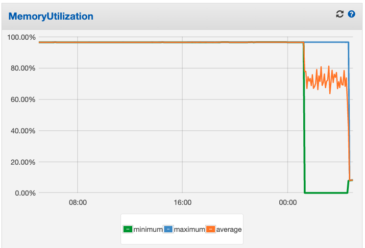
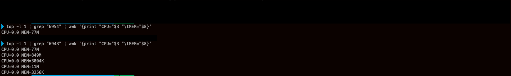
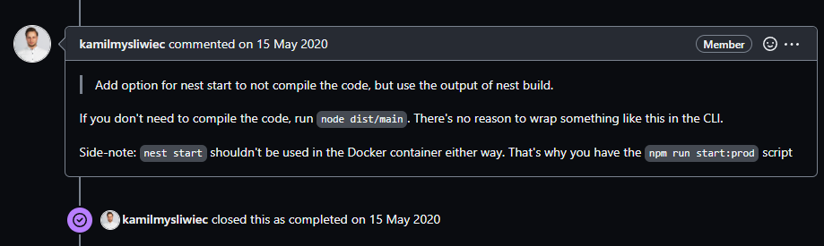

# NestJS의 `npm run start:prod`와 `nest start`



팀에서 팀원분이 NestJS로 프로젝트를 진행하는데 ECS 환경에서 메모리 문제가 있다고 했다. 그래서 확인을 해보니 `nest start` 명령어를 도커 컨테이너에서 직접 사용하는 것이 문제였다.

```
CMD [ "nest", "start" ]
```

본인은 `npm run start:prod`를 사용했었기 때문에 `nest start`가 이질감이 있었고 직접 로컬 환경에서 테스트를 했다.

테스트를 진행한 프로젝트는 컴파일 한 결과물의 경로가 `dist/src/main`이기 때문에 수정을 해서 테스트를 해보았다.



PID가 6954는 `node` 명령어로 직접 컴파일 한 결과물을 실행한 것인데 메모리를 77MB만 차지하고 있다. 그 아래에 `nest start`로 실행한 것은 849MB를 차지하고 있다.

`nest start`가 메모리를 많이 차지한다.



도커 컨테이너 환경에서 `nest start`를 사용하지 말라는 개발자가 남겨놓은 내용을 찾을 수 있다.

코드를 컴파일할 필요가 없는 경우 `node dist/main`을 실행하라고 한다. 그래서 `npm run start:prod` 스크립트를 제공한다고 한다. `nest start`를 도커 컨테이너에서 사용하지 말라고 한다.

실제 배포 환경에서는 컴파일 한 결과물을 `node` 명령어로 실행해서 운영 환경에서 사용해야 한다.
