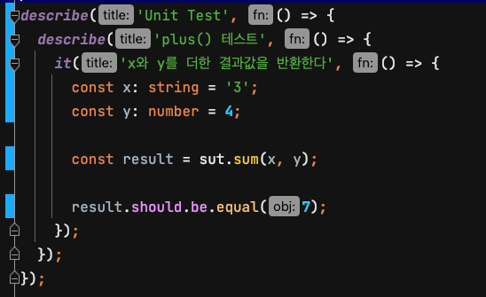
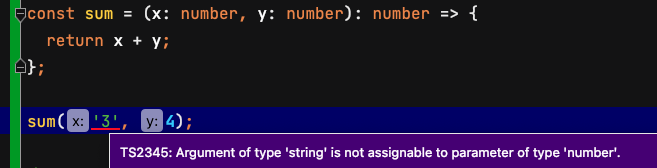
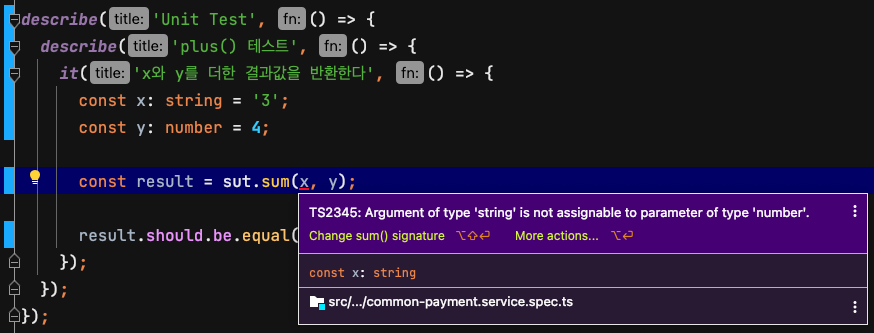

# Typescript의 함수 표현식과 화살표 함수에서 Function으로 타입 선언해서 사용하지 않기

예제 코드로 보면 아래와 같은 화살표 함수가 있다. `sum`이라는 함수를 `Function`으로 타입 선언한다. 이런 함수를 호출해서 사용할 때 매개변수의 타입을 체크하지 못하고 오류를 보여주지도 않는다.

x의 매개변수는 number 타입으로 선언했지만 string이 들어와도 `TS2345` 오류가 보이지 않는다.

```ts
const sum: Function = (x: number, y: number): number => {
  return x + y;
};

sum('3', 4)
```



async 화살표 함수도 `Function` 타입을 선언하면 await을 사용하지 않아도 오류가 발생하지 않는다.

화살표 함수에서 `Function` 타입을 선언해서 개발을 하면 TypeScript를 사용하는 이점이 사라지게 된다.

`Function` 타입으로 선언하지 않으면 사진처럼 타입 검사를 하기 때문에 오류를 개발 과정에서 알 수 있다.






